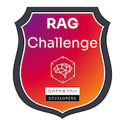
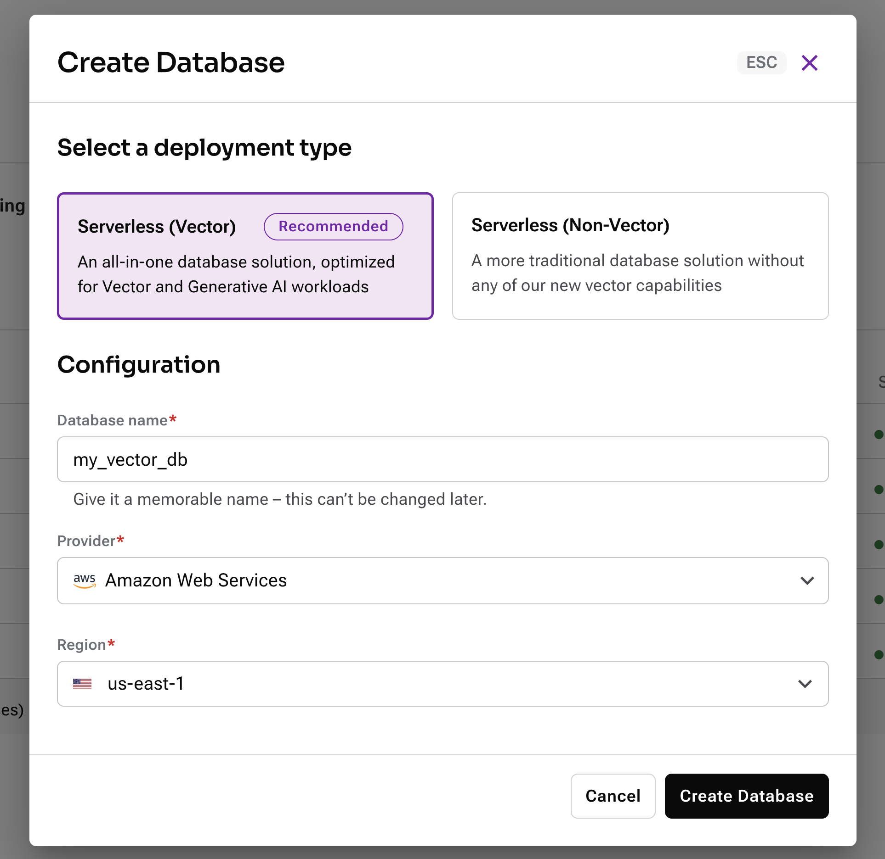
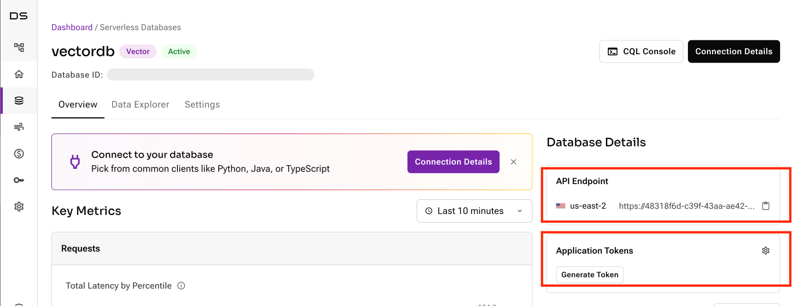
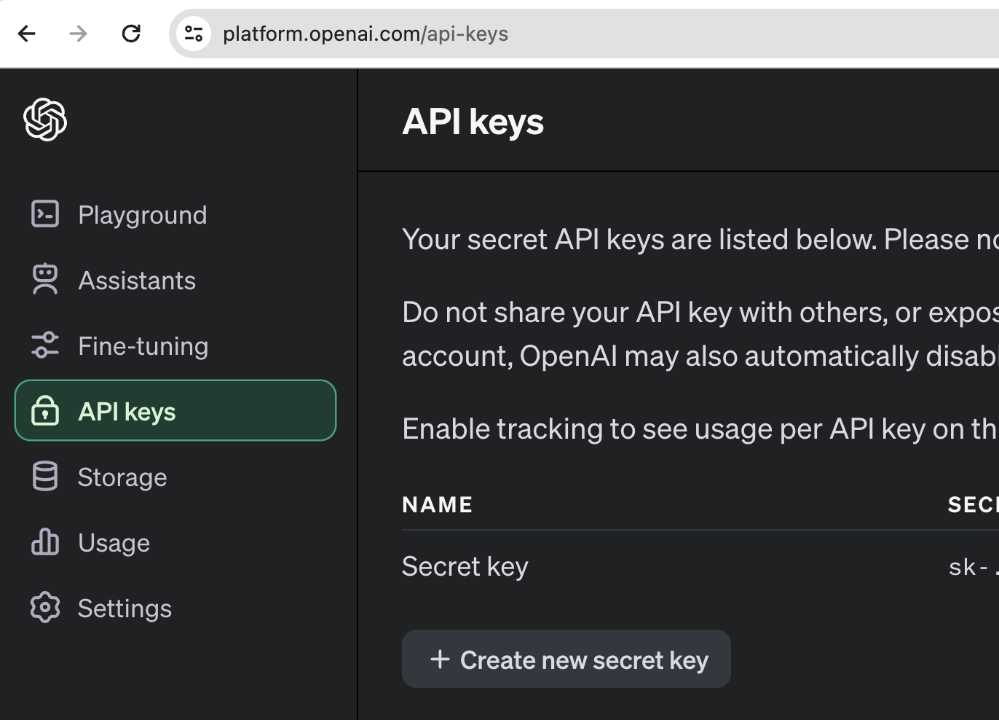
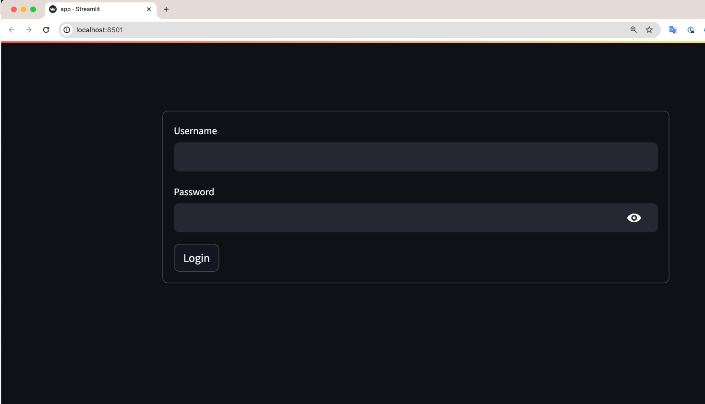
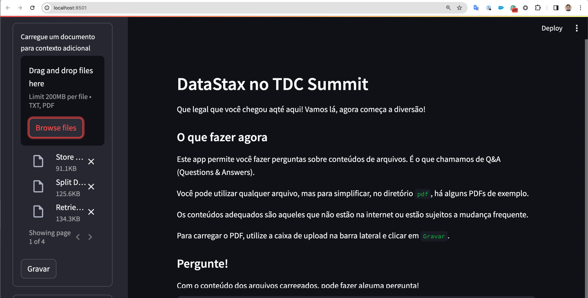
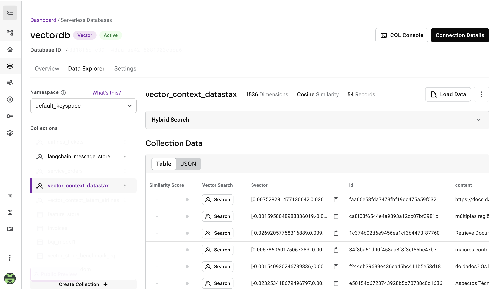
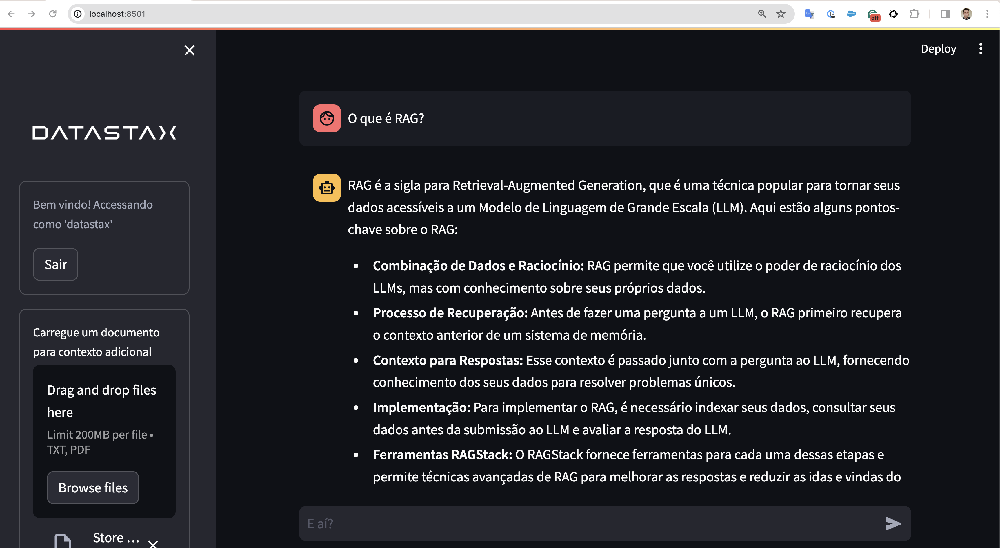

# DataStax no TDC Summit

O DataStax Astra é um banco NoSQL com suporte a Vector Search para alta escala, volume e performance.

Ao completar este exercício, além do conhecimento e dos brindes, você também receberá um badge para compartilhar em suas redes sociais.



## Como ganhar o kit da DataStax?

É bem simples. Basta executar este código e preencher o formulário abaixo.

### O que você precisará

- Python
- Uma chave da OpenAI para gerar embeddings e texto (é possível usar a conta `Trial`)
- Uma conta no Astra

### Resumo

- [Crie uma conta gratuita em astra.datastax.com](#3)
- [Clone este repositório](#1)
- [Instale as dependências](#2)
- [Defina as variáveis no arquivo settings.yaml](#4)
- [Execute o app](#5)
- [Carregue arquivos pdf para utilizar como base de conhecimento](#6)
- [Faça perguntas sobre o conteúdo](#6)
- [Preencha o form](#7)
- Passe no nosso estande para dizer o que achou e retirar seu brinde!

A seguir, o detalhe de como fazer cada passo.

# Passo a passo

### Crie uma conta gratuita em astra.datastax.com <a name="3"></a>

Criar uma conta gratuita e um banco de dados vetorial no Astra é muito simples. Além disso, você ganhará **US$ 300 por ano** para utilizar em seus projetos.

- Acesse [astra.datastax.com/signup](https://astra.datastax.com/signup)
- Registre-se com seu usuário Google, GitHUb ou Email e Senha.

Quando sua conta estiver criada, acesse o Astra Dashboard e clique no botão `Create Database`.

Informe o nome do seu banco de dados, provedor de nuvem (AWS, Google Cloud Provider ou Azure) e região da nuvem.



Pronto! Em cerca de 3 minutos o banco estará disponível para seguir. Enquanto isso, vamos cuidar do código!

### Clone o repositório <a name="1"></a>

O código deste app está disponível neste repositório.

```
git clone https://github.com/smatiolids/datastax-tdc-summit.git
```

### Instale as dependências <a name="2"></a>

Com o Python instalado, instale as bibliotecas

```
pip3 install -r requirements.txt
```
### Defina as variáveis no arquivo settings.yaml <a name="4"></a>

Para que o aplicativo se conecte ao Astra e também à OpenAI, é necessário configurar as variáveis no arquivo `.streamlit/secrets.toml`

- Copie o arquivo `secrets.example.toml` para `secrets.toml`
- Preencha as variáveis com o seguinte

````
OPENAI_API_KEY="sk-<sua chave de API na OpenAI>"
ASTRA_DB_VECTOR_API_ENDPOINT = "<API Endpoint do Astra>"
ASTRA_DB_VECTOR_TOKEN = "<Application Token do Astra>"
````


*Onde encontro os dados do Astra?*

No Astra Dashboard, acesse seu BD e logo na primeira tela, no campo




*Onde encontro a chave na OpenAI?*

- Acesse platform.openai.com
- Após fazer login, acesse a área `API`
- No menu, à esquerda, clique no ícone de cadeado
- Crie uma nova chave em `+ Create new secret key`




### Execute o app<a name="5"></a>

Para executar o app, execute:

```
streamlit run app.py
```
A aplicação severá iniciar no URL: `http://localhost:8501/`

Você deverá ver a tela:



Informe o usuário e senha:

username: `datastax`
password: `astra`

### Carregue arquivos pdf para utilizar como base de conhecimento<a name="6"></a>

Na tela inicial, à esquerda, utilize o botão `Browse files` para selecionar os arquivos que estão no diretório `pdf`.



Clique em gravar e aguarde o processamento. No canto superior haverá um ícone mostrando que o processamento está em execução.

Confira no Astra os dados gravados.



### Faça perguntas sobre o conteúdo <a name="7"></a>

Pronto, com seus dados carregados, pode fazer perguntas sobre o Astra, como:

- O que é RAG?
- Quais as métricas de similaridade?
- Quais linguagens posso usar?



Pronto, você acabou de rodar uma aplicaçãoque usa dados personalizados e IA Generativa!

## Preencha o form com seus dados<a name="8"></a>


Envie seus dados e o Database ID do Astra e envie aqui: https://forms.gle/NgN5bSJq8jgxioMG6

Depois, passe no nosso estande para dizer o que achou, se ficou alguma dúvida e tal... 

Obrigado por participar!


# Contatos

Samuel Matioli - samuel.matioli@datastax.com
Nicole Caetano - nicole.caetano@datastax.com